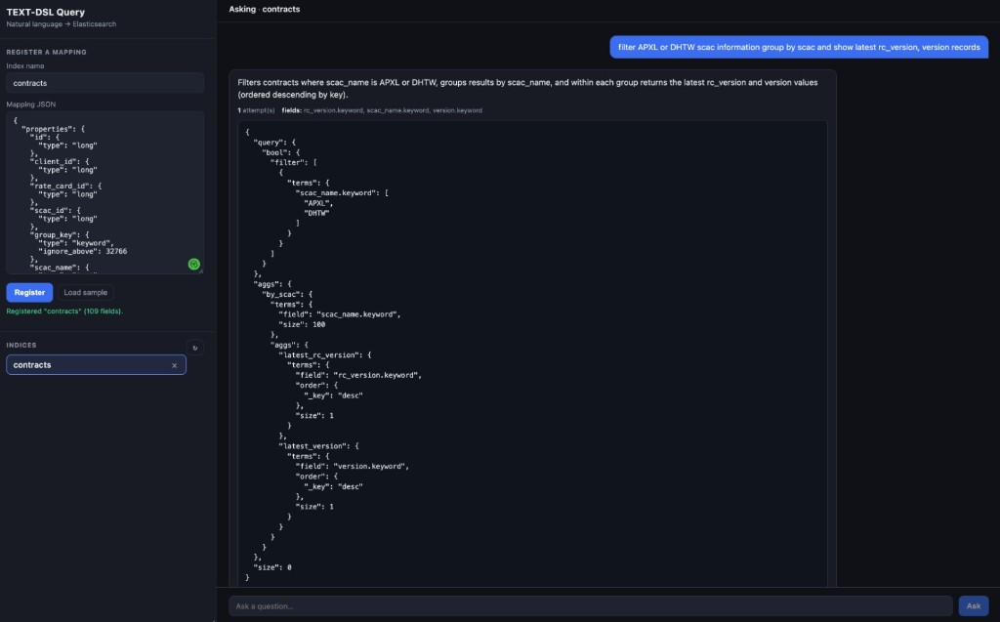
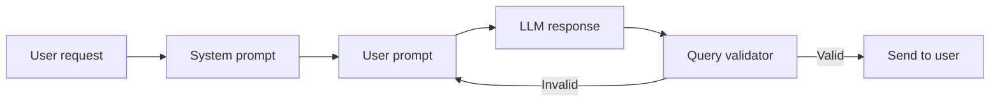

# TEXT-to-DSL Query Generator

Convert natural language questions into **Elasticsearch Query DSL** using an index mapping and Anthropic Claude.

Built with **Node.js** and **Express**. Includes a web UI for registering mappings and asking questions in plain English.



## Features

- Register Elasticsearch index mappings and normalize them into a searchable schema
- Optionally register index **settings** (analyzers / normalizers) so generated queries respect field casing and tokenization
- Ask natural language questions and get validated ES Query DSL
- Web dashboard for mapping + settings registration and chat-style querying
- Built-in query validator with automatic retry (up to 3 attempts)

## Architecture flow



### Step-by-step

| Step | Component | What happens |
|------|-----------|--------------|
| 1 | **User request** | User registers an index mapping (and optionally settings) and asks a question in plain English |
| 2 | **System prompt** | Defines who the model is, what it can do, and the rules (keyword vs text, nested fields, analyzers/normalizers, no scripts, etc.) |
| 3 | **User prompt** | Combines normalized **fields from mapping**, **analysis settings**, **few-shot examples**, and the **user question** |
| 4 | **LLM response** | Claude returns ES Query DSL with an explanation and the fields used |
| 5 | **Query validator** | Checks field names, query types, and mapping compatibility |
| 6 | **Retry loop** | If validation fails, errors are fed back into the prompt and the model retries (max **3 attempts**) |
| 7 | **Send to user** | Valid query, explanation, and used fields are shown in the UI |

### Example

**Question:**
> filter APXL or DHTW scac information group by scac and show latest rc_version, version records

**Generated DSL** (abbreviated):

```json
{
  "query": {
    "bool": {
      "filter": [
        { "terms": { "scac_name.keyword": ["APXL", "DHTW"] } }
      ]
    }
  },
  "aggs": {
    "by_scac": {
      "terms": { "field": "scac_name.keyword", "size": 100 },
      "aggs": {
        "latest_rc_version": {
          "terms": { "field": "rc_version.keyword", "order": { "_key": "desc" }, "size": 1 }
        },
        "latest_version": {
          "terms": { "field": "version.keyword", "order": { "_key": "desc" }, "size": 1 }
        }
      }
    }
  },
  "size": 0
}
```

## Requirements

- Node.js 18+
- [Yarn](https://yarnpkg.com/) 3.x
- Anthropic API key

## Quick start

```bash
git clone git@github.com-booksandbakes:booksandbakes/TEXT-to-DSL-Query-Generator.git
cd TEXT-to-DSL-Query-Generator

yarn install
cp .env.example .env
# Edit .env and set ANTHROPIC_API_KEY

yarn dev
```

Open [http://localhost:3000](http://localhost:3000).

### Using the UI

1. Enter an **index name** (e.g. `contracts`)
2. Paste the **mapping JSON** and click **Register**
3. Select the index from the sidebar
4. Type a question and click **Ask**
5. Review the explanation and generated ES query

## Scripts

```bash
yarn start   # Run server
yarn dev     # Run with auto-reload (Node --watch)
```

## License

MIT
