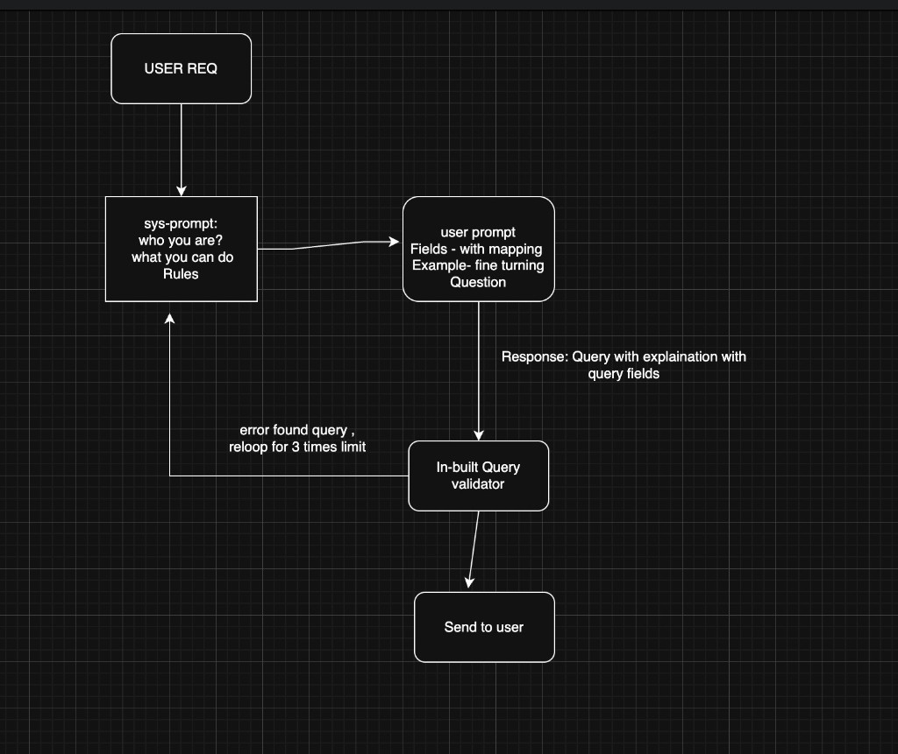
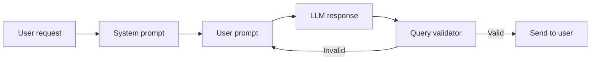

# TEXT-to-DSL Query Generator

Convert natural language questions into **Elasticsearch Query DSL** using an index mapping and Anthropic Claude.

Built with **Node.js** and **Express**. Includes a web UI for registering mappings and asking questions in plain English.


## Features

- Register Elasticsearch index mappings and normalize them into a searchable schema
- Ask natural language questions and get validated ES Query DSL
- Web dashboard at `/` (Vue)
- REST API for programmatic use
- Built-in query validator with automatic retry (up to 3 attempts)

## Architecture flow





### Step-by-step

| Step | Component | What happens |
|------|-----------|--------------|
| 1 | **User request** | User registers an index mapping and asks a question in plain English |
| 2 | **System prompt** | Defines who the model is, what it can do, and the rules (keyword vs text, nested fields, no scripts, etc.) |
| 3 | **User prompt** | Combines normalized **fields from mapping**, **few-shot examples**, and the **user question** |
| 4 | **LLM response** | Claude returns ES Query DSL with an explanation and the fields used |
| 5 | **Query validator** | Checks field names, query types, and mapping compatibility |
| 6 | **Retry loop** | If validation fails, errors are fed back into the prompt and the model retries (max **3 attempts**) |
| 7 | **Send to user** | Valid query + explanation + `usedFields` returned to the UI or API |

### Example

**Question:**
> filter APXL or DHTW scac information group by scac and show latest rc_version, version records

**Generated DSL** (abbreviated):

```json
{
  "query": {
    "bool": {
      "filter": [
        { "terms": { "scac_name.keyword": ["APXL", "DHTW"] } }
      ]
    }
  },
  "aggs": {
    "by_scac": {
      "terms": { "field": "scac_name.keyword", "size": 100 },
      "aggs": {
        "latest_rc_version": {
          "terms": { "field": "rc_version.keyword", "order": { "_key": "desc" }, "size": 1 }
        },
        "latest_version": {
          "terms": { "field": "version.keyword", "order": { "_key": "desc" }, "size": 1 }
        }
      }
    }
  },
  "size": 0
}
```

## Requirements

- Node.js 18+
- [Yarn](https://yarnpkg.com/) 3.x
- Anthropic API key

## Quick start

```bash
git clone git@github.com-booksandbakes:booksandbakes/TEXT-to-DSL-Query-Generator.git
cd TEXT-to-DSL-Query-Generator

yarn install
cp .env.example .env
# Edit .env and set ANTHROPIC_API_KEY

yarn dev
```

Open [http://localhost:3000](http://localhost:3000).

### Using the UI

1. Enter an **index name** (e.g. `contracts`)
2. Paste the **mapping JSON** and click **Register**
3. Select the index from the sidebar
4. Type a question and click **Ask**
5. Review the explanation and generated ES query

## Environment variables

| Variable | Description | Default |
|----------|-------------|---------|
| `PORT` | HTTP server port | `3000` |
| `HOST` | Bind address | `0.0.0.0` |
| `ANTHROPIC_API_KEY` | Anthropic API key | — |
| `ANTHROPIC_MODEL` | Claude model | `claude-opus-4-8` |
| `ANTHROPIC_BASE_URL` | Optional API base URL | — |

## Main APIs

### 1. Initialize index (register mapping)

Registers an ES index mapping so the app knows which fields can be queried.

**`PUT /mappings/:index`**

```bash
curl -X PUT http://localhost:3000/mappings/contracts \
  -H "Content-Type: application/json" \
  -d '{
    "properties": {
      "scac_name": { "type": "keyword" },
      "rc_version": { "type": "keyword" },
      "version": { "type": "keyword" }
    }
  }'
```

**Response:**

```json
{
  "index": "contracts",
  "message": "Mapping registered",
  "fieldCount": 109
}
```

### 2. Ask a question (generate query)

Converts a natural language question into validated Elasticsearch Query DSL.

**`POST /ask`**

```bash
curl -X POST http://localhost:3000/ask \
  -H "Content-Type: application/json" \
  -d '{
    "index": "contracts",
    "question": "filter APXL or DHTW scac information group by scac and show latest rc_version, version records"
  }'
```

**Response:**

```json
{
  "query": { "...": "ES Query DSL" },
  "explanation": "Filters contracts where scac_name is APXL or DHTW...",
  "usedFields": ["scac_name.keyword", "rc_version.keyword", "version.keyword"],
  "attempts": 1
}
```

## All endpoints

| Method | Path | Description |
|--------|------|-------------|
| `GET` | `/` | Web UI |
| `GET` | `/health` | Health check |
| `GET` | `/mappings` | List registered indices |
| `PUT` | `/mappings/:index` | Register index mapping |
| `GET` | `/mappings/:index/schema` | Normalized field schema |
| `DELETE` | `/mappings/:index` | Remove a mapping |
| `POST` | `/ask` | Natural language → ES query |

## Project structure

```text
src/
  server.js              # Entry point
  plugin.js              # Core text-to-ES logic
  config.js              # Environment config
  http/                  # Express routes & handlers
  mapping/               # ES mapping normalization
  prompt/                # System + user prompt building
  generator/             # Anthropic query generation
  validate/              # DSL + mapping validation
public/
  index.html             # Vue web UI
docs/
  images/                # README screenshots & diagrams
```

## Scripts

```bash
yarn start   # Run server
yarn dev     # Run with auto-reload (Node --watch)
```

## License

MIT
